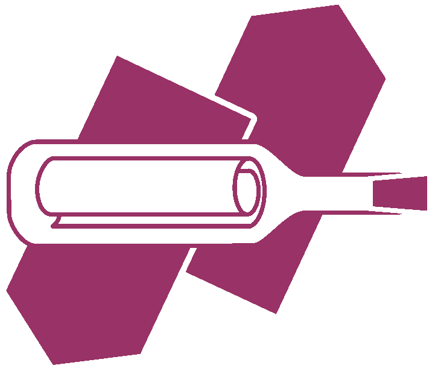

<div align=center>

<h1>The Troca Chat Frontend</h1>
</div>

[](https://github.com/The-Penguin-Circle/chat-frontend/actions) [](https://github.com/The-Penguin-Circle/chat-frontend/blob/master/LICENSE)

> barrier-free chat application

This is the backend for the Troca chat app, created on the 2020 Q1
Hackathon of the Welthungerhilfe. It communicates
with the frontend over websockets.

## Build Setup

``` bash
# install dependencies
$ npm install

# serve with hot reload at localhost:3000
$ npm run dev

# build for production and launch server
$ npm run build
$ npm run start

# generate static project
$ npm run generate
```

For detailed explanation on how things work, check out [Nuxt.js docs](https://nuxtjs.org).

## License

    The Troca Chat Backend
    Copyright (C) 2020  github.com/ a1core, pidoubleju, skyfrk, wanLo, glatteis

    This program is free software: you can redistribute it and/or modify
    it under the terms of the GNU General Public License as published by
    the Free Software Foundation, either version 3 of the License, or
    (at your option) any later version.

    This program is distributed in the hope that it will be useful,
    but WITHOUT ANY WARRANTY; without even the implied warranty of
    MERCHANTABILITY or FITNESS FOR A PARTICULAR PURPOSE.  See the
    GNU General Public License for more details.
